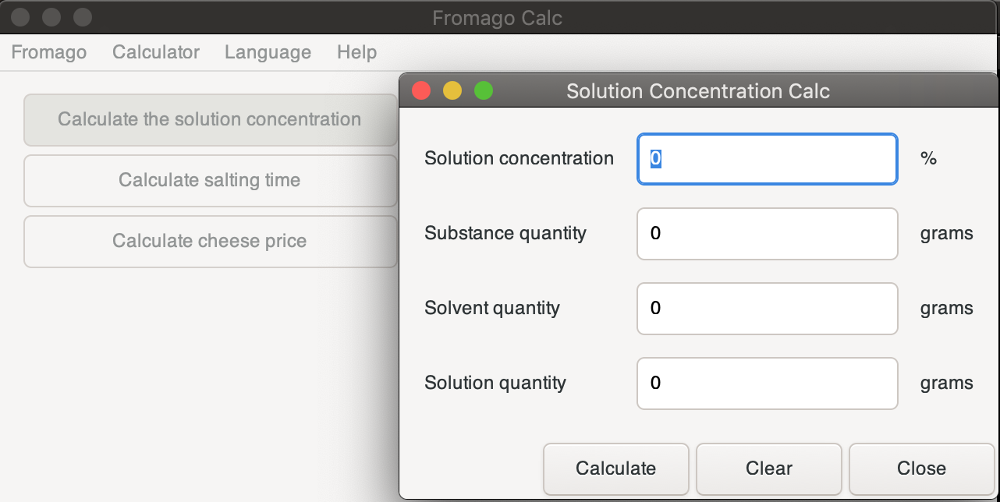

</img>
# Fromago

A ratio calculator for cooking cheese.

# How to build the app
### Requirements
1. `dmd`, `gdc` or `ldc` [D compiler](https://dlang.org/download.html)
2. `dub` [package manager](https://github.com/dlang/dub/releases/tag/v1.23.0)
3. [GTK+](https://gtkd.org/download.html) runtime

### Building the app 
1. Clone the repository or download the latest [release](https://gitlab.com/kirillsaidovd/fromago/-/releases)
2. Open up your terminal and `cd` to the `fromago` folder
3. Type `dub` and press the return key

Dub will download the additional libraries it needs and then it will build the app. The executable can be found in the `bin` folder.

# Usage
Fromago has `Documentation` built into the app. It can be found at the top of the menu. [soon]

